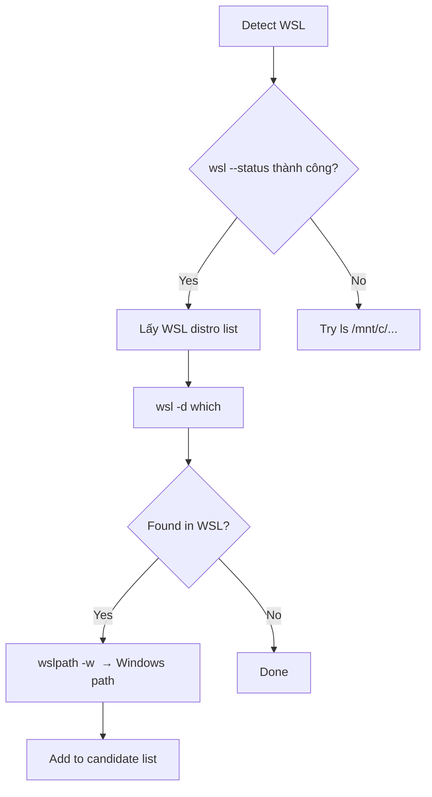

# Agent Binary Detection — Phân Tích & Kế Hoạch Nâng Cấp

> **Mục tiêu:** Phân tích toàn bộ luồng phát hiện (detect) Agent binary đã cài đặt trên
> máy người dùng, từ đó chỉ ra các lỗ hổng, điểm mù, rủi ro và đề xuất giải pháp nâng cấp
> hoàn chỉnh, bền vững, đa nền tảng.

---

## 1. Hiện Trạng: Vòng Đời Phát Hiện Agent Binary

### 1.1 Các lớp (layer) tham gia

| Layer | File | Vai trò |
|-------|------|---------|
| **AgentRegistry** | `agent/AgentRegistry.java` | Hardcoded map agent ID → factory class. **Không có detection logic.** |
| **BinaryDetector** | `settings/BinaryDetector.java` | Core utility: tìm binary trên PATH, version parsing, compareVersions. |
| **ClientBinaryDetector** | `settings/ClientBinaryDetector.java` | Abstract base: override → `BinaryDetector.findAllBinaryPaths` → pick highest version. |
| **ProfileBinaryDetector** | `settings/ProfileBinaryDetector.java` | Extension: đọc `AgentProfile.getCustomBinaryPath()`. |
| **AgentBinaryResolver** | `settings/AgentBinaryResolver.java` | Một abstract resolver khác (tương tự `ClientBinaryDetector` nhưng độc lập). |
| **AcpClientBinaryResolver** | `settings/AcpClientBinaryResolver.java` | Resolver cho ACP client, đọc từ `AgentProfileManager.loadBinaryPath()`. |
| **SmartAgentDetector** | `settings/SmartAgentDetector.java` | Chạy detection cho **tất cả profile** trong background, lưu kết quả. |
| **ShellEnvironment** | `settings/ShellEnvironment.java` | Capture login shell env (nvm, sdkman, cargo, pyenv, mise) dùng cho detection và runtime. |
| **ProfileBasedAgentConfig** | `bridge/ProfileBasedAgentConfig.java` | `findAgentBinary()` — gọi `ProfileBinaryDetector.resolve()` → fallback `BinaryDetector.findBinaryPath()`. |
| **AcpClient** | `acp/client/AcpClient.java` | `resolveBinary()` — gọi `AcpClientBinaryResolver.resolve()` → fallback `BinaryDetector.findBinaryPath()`. |
| **ClaudeCliClient** | `agent/claude/ClaudeCliClient.java` | `resolveBinary()` — gọi `ProfileBinaryDetector.resolve("claude")`. |
| **AgentProfileManager** | `services/AgentProfileManager.java` | Quản lý profiles + delta persistence. Lưu `customBinaryPath`. |

### 1.2 Luồng chi tiết hiện tại

```mermaid
flowchart TD
    A[AcpConnectPanel mở] --> B{agentBinaryDetectionRun?}
    B -->|false| C[SmartAgentDetector.detectAllInBackground]
    B -->|true| E[User chọn profile từ combo]
    
    C --> D[Duyệt từng AgentProfile]
    D --> F[BinaryDetector.findAllBinaryPaths<br>cho name + alternates]
    F --> G[BinaryDetector.getVersionForPath<br>cho từng candidate]
    G --> H[Chọn highest version]
    H --> I[AgentProfileManager.saveBinaryPath]
    
    E --> J[Người dùng click Connect]
    J --> K{Client type?}
    K -->|ACP client| L[AcpClient.resolveBinary]
    K -->|Claude CLI| M[ClaudeCliClient.resolveBinary]
    K -->|Custom/Other| N[ProfileBasedAgentConfig.findAgentBinary]
    
    L --> O[AcpClientBinaryResolver.resolve]
    O --> P{Custom path set?}
    P -->|Yes| Q[Return custom path]
    P -->|No| R[BinaryDetector.findAllBinaryPaths<br>→ pick highest version]
    
    M --> S[ProfileBinaryDetector.resolve]
    S --> T{Custom path set?}
    T -->|Yes| U[Return custom path]
    T -->|No| V[BinaryDetector.findAllBinaryPaths<br>for "claude"]
    
    N --> W[ProfileBinaryDetector.resolve]
    W --> X{Custom path set?}
    X -->|Yes| Y[Return custom path]
    X -->|No| Z[BinaryDetector.findBinaryPath<br>for name + alternates]
    
    R --> AA{Found?}
    AA -->|No| AB[Error: binary not found]
    AA -->|Yes| AC[tryResolveBareName → normalize → launch]
```

### 1.3 Quy trình phát hiện của `BinaryDetector.findBinaryPath()`

```
1. Windows? → findBinaryOnWindowsPath (Java File API, tránh encoding issues)
2. Unix:
   a. "command -v <name>" via sh -c
   b. whereis -b <name> + which -a <name>
   c. mise bin-paths
   d. findAllBinaryPaths:
      - whereis/which (dedup)
      - mise bin-paths
      - scan PATH directories
      - scan common system dirs (/usr/local/bin, /opt/homebrew/bin, ...)
```

### 1.4 Quy trình phát hiện của `BinaryDetector.tryDetectBinary()` (detect version)

```
1. "command -v <name> && <name> --version" (5s timeout)
2. Each path from findUsingNativeTools → <path> --version
3. Each path from findAllBinaryPaths → <path> --version
   → parseVersion() quét output tìm pattern "digit.digit"
```

### 1.5 Cách `ShellEnvironment` capture env

- Unix: spawn `$SHELL -l -c "{ script init nvm, sdkman, cargo, pyenv, mise; env; }"` (10s timeout)
- Lưu vào static cache `volatile Map<String,String>`
- `refresh()` xoá cache → lần gọi tiếp theo re-capture
- **Vấn đề:** Không chạy trên Windows → luôn dùng `System.getenv()` (mất nvm-windows, scoop, etc.)

---

## 2. Các Vấn Đề và Lỗ Hổng (Root Cause Analysis)

### 2.1 Không có một "source of truth" duy nhất cho trạng thái cài đặt

| Vấn đề | Mô tả | Mức độ |
|--------|-------|--------|
| **P1** | `AgentRegistry` không hỗ trợ truy vấn "agent X có installed không?" — nó chỉ là map ID → factory | **CRITICAL** |
| **P2** | `AgentProfile` không có field `isBinaryDetected` / `detectedBinaryPath` (chỉ có `customBinaryPath` là user-set) | **CRITICAL** |
| **P3** | `SmartAgentDetector.saveBinaryPath()` lưu vào `customBinaryPath` — đây là trường cho user override, **không phân biệt** được auto-detect vs user-set | **CRITICAL** |
| **P4** | `showOnlyInstalledAgents` tồn tại trong `AgentBridgeStorageSettings.State` nhưng **không bao giờ được đọc** | **MAJOR** |
| **P5** | Không có mechanism nào để UI biết "profile này có binary không" trước khi user click Connect | **MAJOR** |

**Hậu quả:** Người dùng thấy đầy đủ danh sách agent trong dropdown (Copilot, Junie, Kiro, OpenCode, Hermes, Claude, Codex, OpenClaw, Pi) **ngay cả khi chưa cài đặt agent nào**. Khi click Connect, mới fail với error "binary not found". UX cực kỳ tệ.

### 2.2 Logic detection bị phân tán, trùng lặp

| Vấn đề | Mô tả |
|--------|-------|
| **P6** | `ClientBinaryDetector.resolve()` và `AgentBinaryResolver.findBestBinaryAcrossNames()` có logic gần giống hệt nhau: findAllBinaryPaths → compareVersions → pick best |
| **P7** | `ProfileBasedAgentConfig.findAgentBinary()` tự implement detection riêng (dùng `ProfileBinaryDetector.resolve`) |
| **P8** | `AcpClient.resolveBinary()` tự implement detection riêng (dùng `AcpClientBinaryResolver.resolve`) |
| **P9** | `ClaudeCliClient.resolveBinary()` tự implement detection riêng (dùng `ProfileBinaryDetector.resolve`) |
| **P10** | `SmartAgentDetector.detectAll()` implement detection lần thứ N nhưng hoàn toàn độc lập |
| **P11** | Mỗi nơi dùng `BinaryDetector.findBinaryPath` vs `findAllBinaryPaths` khác nhau → kết quả không nhất quán |

**Hậu quả:** Cùng một binary có thể được phát hiện khác nhau tuỳ chỗ. Khó maintain, khó fix bug, khó thêm agent mới.

### 2.3 Shell Environment không đáng tin cậy

| Vấn đề | Mô tả | Mức độ |
|--------|-------|--------|
| **P12** | `ShellEnvironment` là `static volatile` cache — nếu capture thất bại, `getEnvironment()` trả về map rỗng và không bao giờ retry | **MAJOR** |
| **P13** | Windows: luôn fallback về `System.getenv()` — không capture nvm-windows, scoop, chocolatey paths | **MAJOR** |
| **P14** | Cache lifetime: chỉ refresh khi ai đó gọi `ShellEnvironment.refresh()` — UI có nút "Search" gọi refresh, nhưng nếu user install agent trong khi IDE đang mở, không có auto-refresh | **MINOR** |
| **P15** | Timeout 10s cho shell capture — nếu bashrc chậm (nvm, sdkman), detection có thể fail im lặng | **MAJOR** |
| **P16** | Không fallback strategy: nếu login shell capture fail, thử non-login shell, nếu vẫn fail thì dùng System.getenv() — nhưng không log cảnh báo rõ ràng | **MINOR** |

### 2.4 Multi-platform gaps

| Vấn đề | Mô tả | Mức độ |
|--------|-------|--------|
| **P17** | **WSL (Windows Subsystem for Linux) không được hỗ trợ.** Agent có thể được cài trong WSL distro, plugin hoàn toàn mù | **CRITICAL** |
| **P18** | **macOS: không support `brew --prefix` để tìm cellar paths** (dựa vào hardcoded `/opt/homebrew/bin` và `/usr/local/bin`) | **MAJOR** |
| **P19** | **Linux: không support snap, flatpak, AppImage paths** ngoại trừ `/snap/bin/gh` (chỉ cho gh CLI) | **MAJOR** |
| **P20** | **Windows: `where.exe` encoding issue** — đã fix bằng Java File API fallback, nhưng Phase 1 vẫn dùng `where` | **MINOR** |
| **P21** | **Windows: không support Scoop, Chocolatey, winget** paths ngoài standard PATH | **MAJOR** |
| **P22** | **WSL interop:** agent binary trong `/mnt/c/...` hoặc Linux binary từ WSL khi IDE chạy trên Windows | **CRITICAL** |

### 2.5 Missing features

| Vấn đề | Mô tả | Mức độ |
|--------|-------|--------|
| **P23** | **Không có periodic background re-detection** — detection chỉ chạy 1 lần (khi mở connect panel lần đầu) | **MAJOR** |
| **P24** | **Không có file watcher** cho các đường dẫn agent hay PATH thay đổi | **NICE** |
| **P25** | **Không có "detection status" API** để UI rendering agents theo trạng thái (installed / not installed) | **MAJOR** |
| **P26** | **Không có graceful degradation** — nếu binary detection fail, không có suggestion cài đặt (nút "Install") trong UI | **MAJOR** |
| **P27** | **Không support agent install via package manager** (npm/pip/brew/scoop) từ trong plugin | **NICE** |

### 2.6 Code quality & maintenance

| Vấn đề | Mô tả |
|--------|-------|
| **P28** | `ClientBinaryDetector` và `AgentBinaryResolver` là hai class tree độc lập cho cùng một mục đích |
| **P29** | `BinaryDetector` là `public class` (không final, không interface) — dễ bị phụ thuộc cứng trong unit test |
| **P30** | `SmartAgentDetector.detectAll()` implement detection logic từ đầu thay vì gọi `ClientBinaryDetector.resolve()` hoặc `AgentBinaryResolver.resolve()` |
| **P31** | `AgentBridgeStorageSettings.State.agentBinaryDetectionRun` chỉ được set true, không có cơ chế reset khi cài agent mới |
| **P32** | `BinaryDetector.compareVersions()` dùng regex `replaceAll("^\\D*", "")` để strip prefix — fragile, không handle tốt version như "2.0.0-beta" |

---

## 3. Phân Tích Chi Tiết Từng Layer

### 3.1 `BinaryDetector` — Core detection engine

```java
// Current strengths:
// - Multi-phase: command -v → whereis/which → mise → PATH scan → common dirs
// - Windows fallback dùng Java File API (tránh encoding bug)
// - Version comparison có unit test
//
// Current weaknesses:
// - findBinaryPath vs findAllBinaryPaths có logic khác nhau
// - tryDetectBinary implement lại findBinaryPath + version flag thay vì tái sử dụng
// - runCommand dùng ShellEnvironment.getEnvironment() (cached, có thể stale)
// - Không retry khi subprocess fail
// - mise bin-paths chỉ scan 5 hardcoded paths — bỏ sót mise cài ở nơi khác
// - collectFromDirs dùng File.isFile() — không check executable bit (Unix)
// - findUsingNativeTools dùng "which -a" — macOS which không support -a flag
```

### 3.2 `ShellEnvironment` — Environment capture

```java
// Unix capture:
// - Spawn login shell ("-l") + source nvm/sdkman/cargo/pyenv/mise
// - Timeout 10s
// - Fallback: non-login shell → System.getenv()
//
// Windows capture:
// - System.getenv() — NO CUSTOM CAPTURE
// - Mất scoop shims, nvm-windows, chocolatey bin dirs
//
// Issues:
// - Static cache → không thread-safe cho refresh (race condition)
// - Không capture được các biến môi trường động như VOLTA_HOME, PNPM_HOME, BUN_INSTALL
// - buildEnvCaptureCommand không check mise activate nếu mise cài khác path
```

### 3.3 `SmartAgentDetector` — Batch detection orchestrator

```java
// Called from:
// - AcpConnectPanel khởi tạo (lần đầu, force=false)
// - Nút "Search for installed agents" (force=true)
//
// Flow:
// 1. Duyệt từng AgentProfile
// 2. findAllBinaryPaths cho binaryName + alternates
// 3. getVersionForPath cho mỗi candidate
// 4. Lưu best path → AgentProfileManager.saveBinaryPath()
//
// Vấn đề:
// - Lưu vào customBinaryPath (user-override field!) — không phân biệt auto vs manual
// - Không có rollback: nếu lần detect sau không tìm thấy, không xoá path cũ
// - Không có progress indicator chi tiết (chỉ setText per profile)
// - Không cache kết quả detection trong session
// - Nếu detect bị cancel (indicator.isCanceled), không lưu partial results
```

### 3.4 UI layer (`AcpConnectPanel.kt`)

```kotlin
// Profile combo: show ALL AgentProfileManager.getAllProfiles()
// → không lọc theo installation status
//
// showOnlyInstalledAgents flag: tồn tại trong State nhưng NEVER READ
//
// Nút "Search": gọi ShellEnvironment.refresh() + SmartAgentDetector.detectAllInBackground(true)
// → OK nhưng kết quả detection không auto-update UI
//
// updateProfileStatus(): chỉ update status icon khi profile đang active
// → không show "not installed" warning
```

---

## 4. Giải Pháp Đề Xuất

### 4.1 Kiến trúc đích (Target Architecture)

```mermaid
flowchart TD
    subgraph "AgentDetectionService (NEW — singleton)"
        A[detectAll<br/>scanAllProfiles]
        B[isInstalled<br/>query by profileId]
        C[getDetectedPath<br/>query by profileId]
        D[getDetectionStatus<br/>enum NOT_FOUND|FOUND_BY_AUTO|FOUND_BY_USER]
        E[forceRedetect<br/>background async]
        F[addFileWatcher<br/>monitor PATH dirs]
        G[getInstalledProfiles<br/>return list for UI]
    end
    
    subgraph "BinaryDetector (REFACTORED)"
        H[findBinaryPath<br/>single result]
        I[findAllBinaryPaths<br/>multi result]
        J[detectHighestVersion<br/>find + version compare]
        K[detectVersion<br/>get version for path]
    end
    
    subgraph "ShellEnvironment (IMPROVED)"
        L[capture<br/>login shell + fallback]
        M[captureWindows<br/>with scoop/ chocolately/ nvm-windows]
        N[captureWsl<br/>WSL interop]
        O[watchPathChanges<br/>file watcher on PATH dirs]
    end
    
    subgraph "AgentProfile (EXTENDED)"
        P[+detectedBinaryPath<br/>String, auto-set]
        Q[+lastDetectedAt<br/>Instant]
        R[+detectionSource<br/>NONE|AUTO|USER]
    end
    
    subgraph "UI (UPGRADED)"
        S[profileCombo<br/>filter by installed]
        T[installBanner<br/>show for non-installed]
        U[installationGuide<br/>click-to-install hint]
        V[statusIndicator<br/>green/red per agent]
    end

    A --> H
    A --> J
    A --> P
    S --> G
```

### 4.2 Uni-Model cho Detection (Entity Design)

```java
// ── Trạng thái detection (mới) ──

public enum DetectionSource {
    NONE,            // Chưa detect / không tìm thấy
    AUTO_DETECTED,   // Tự động phát hiện (PATH scan)
    USER_CONFIGURED  // Người dùng set custom path
}

// ── Mở rộng AgentProfile ──
// Thêm vào AgentProfile.java:

private String detectedBinaryPath = "";   // auto-detected path (READ-ONLY for UI)
private Instant lastDetectedAt = null;    // thời điểm detect gần nhất
private DetectionSource detectionSource = DetectionSource.NONE;

// Phân biệt rõ ràng:
// customBinaryPath: user-set → có hiệu lực override tuyệt đối
// detectedBinaryPath: auto-set → chỉ dùng khi customBinaryPath rỗng
```

### 4.3 Central Detection Service

```java
@Service(Service.Level.APP)
public final class AgentDetectionService {
    
    // ── Public API ──
    
    /** Is profile's agent installed? (cached + real-time check) */
    boolean isInstalled(String profileId);
    
    /** Get all profiles where agent is installed */
    List<AgentProfile> getInstalledProfiles();
    
    /** Get effective binary path (custom > detected > null) */
    @Nullable String resolveBinary(String profileId);
    
    /** Get detection status for UI rendering */
    DetectionStatus getStatus(String profileId);
    
    /** Force re-detect now (background) */
    CompletableFuture<Void> reDetectAll();
    
    /** Called when PATH or environment may have changed */
    void onEnvironmentChanged();
    
    // ── Internal ──
    
    // Cache: Map<profileId, DetectionResult>
    // DetectionResult: {path, version, source, detectedAt}
    // Refresh policy:
    //   - Lazy: on first query
    //   - Periodic: every N minutes via Alarm
    //   - Event: on ShellEnvironment.refresh()
    //   - Manual: user clicks "Search"
    
    // Backward compatibility:
    //   - Nếu profile có customBinaryPath → source=USER_CONFIGURED
    //   - Nếu profile có customBinaryPath rỗng nhưng SmartAgentDetector
    //     từng lưu vào đó → migrate lên detectedBinaryPath + clear customBinaryPath
}
```

### 4.4 Giải pháp cho từng vấn đề

#### P1-P5: Không có source of truth cho installation status

**Giải pháp:**
1. Tách `customBinaryPath` (user override) và `detectedBinaryPath` (auto-detect) trong `AgentProfile`
2. `AgentDetectionService` là single source of truth cho "agent X installed?"
3. `AgentRegistry` được extend thêm method `isInstalled(profileId)`
4. `showOnlyInstalledAgents` trong settings được UI đọc thật sự
5. UI profile combo filter theo `AgentDetectionService.getInstalledProfiles()` khi flag bật

**Rủi ro:** Migration path cho user đã set customBinaryPath — cần migrate 1 lần.

#### P6-P11: Logic detection trùng lặp

**Giải pháp:**
1. **Merge** `ClientBinaryDetector` + `AgentBinaryResolver` → `AbstractBinaryResolver`
2. Các sub-class `ProfileBinaryDetector`, `AcpClientBinaryResolver`, `GhBinaryDetector` extend `AbstractBinaryResolver`
3. `BinaryDetector` giữ nguyên làm utility (static methods)
4. `AcpClient.resolveBinary()`, `ClaudeCliClient.resolveBinary()`, `ProfileBasedAgentConfig.findAgentBinary()` đều gọi `AgentDetectionService.resolveBinary()`

**Rủi ro:** Có thể ảnh hưởng đến startup timing nếu detection chậm. Giải pháp: lazy detection + caching.

#### P12-P16: Shell Environment không đáng tin cậy

**Giải pháp:**
1. **Retry logic:** nếu capture trả về empty map, retry 1 lần sau 1s
2. **Windows enhancement:** capture scoop (`~/.scoop/shims`), chocolatey (`C:\ProgramData\chocolatey\bin`), nvm-windows (`~/AppData/Roaming/nvm`), winget (`~/AppData/Local/Microsoft/WinGet`), bun, pnpm
3. **Add VOLTA_HOME, PNPM_HOME, BUN_INSTALL** vào env capture script
4. **Timeout tăng:** 10s → 15s, nhưng thêm early-break nếu stdout đã có đủ biến chính
5. **Non-blocking capture:** dùng `CompletableFuture` cho lần capture đầu tiên để không block EDT
6. **Periodic refresh:** `Alarm` mỗi 5 phút check PATH thay đổi (so checksum)

**Rủi ro:** Performance impact nếu refresh quá thường xuyên. Mitigation: chỉ refresh khi có thay đổi (dùng file watcher on PATH dirs).

#### P17-P22: Multi-platform gaps

**Giải pháp chi tiết:**

##### WSL (P17, P22)



- Dùng `wsl --status` để detect WSL
- `wsl -d <distro> sh -c "command -v <agent>"` để tìm binary
- `wslpath -w <path>` để convert Linux path → Windows path
- Nếu IDE chạy trong WSL (`$WSL_DISTRO_NAME` set), detect cross-platform khác

**Rủi ro:** `wsl` command có thể không có trên PATH nếu WSL chưa install. Cần try-catch im lặng.

##### macOS (P18)

```java
// Thay vì hardcode /opt/homebrew/bin và /usr/local/bin:
String brewPrefix = runCommand(List.of("brew", "--prefix"), 3);
if (brewPrefix != null) {
    // brew --prefix trả về /opt/homebrew (Apple Silicon) hoặc /usr/local (Intel)
    commonDirs.add(brewPrefix.trim() + "/bin");
    commonDirs.add(brewPrefix.trim() + "/opt/<agent>/bin");
}
// Thêm: ~/.local/bin (pip --user, mise), ~/.cargo/bin
```

**Rủi ro:** `brew --prefix` chậm (~200ms). Cache kết quả.

##### Linux (P19)

```java
// Bổ sung:
// - ~/.local/bin (đã có nhưng thêm cho Linux)
// - /snap/bin/<agent>
// - /var/lib/flatpak/exports/bin/<agent>
// - ~/.local/share/appimage/<agent>
// - /app/bin/<agent> (Flatpak runtime)
```

**Rủi ro:** Quá nhiều paths → detection chậm. Giải pháp: chỉ scan khi `findAllBinaryPaths` trả về empty.

##### Windows (P20, P21)

```java
// Bổ sung vào findOnPath / findBinaryOnWindowsPath:
// - Scoop: System.getProperty("user.home") + "/scoop/shims"
// - Chocolatey: System.getenv("ChocolateyInstall") + "/bin" (default: C:\ProgramData\chocolatey\bin)
// - nvm-windows: System.getenv("NVM_HOME") (default: ~/AppData/Roaming/nvm)
// - winget: ~/AppData/Local/Microsoft/WinGet/links
// - bun: System.getenv("BUN_INSTALL") + "/bin"
// - pnpm: System.getenv("PNPM_HOME") (có thể đã trong PATH)
```

**Rủi ro:** Biến môi trường có thể null. Cần default paths fallback.

#### P23-P27: Missing features

##### Periodic re-detection (P23)
- `AgentDetectionService` có scheduled task chạy mỗi 5 phút
- Nếu phát hiện binary mới → publish event → UI update
- Nếu phát hiện binary biến mất → clear detected path → UI update

##### File watcher (P24)
- Dùng `java.nio.file.WatchService` trên các directory trong PATH
- Khi có thay đổi → `onEnvironmentChanged()`

**Rủi ro:** WatchService có memory leak nếu không close đúng. Dùng IntelliJ's VirtualFileManager.

##### Detection status API (P25)

```java
// AgentDetectionService cung cấp:
enum DetectionStatus {
    NOT_FOUND,           // Không detect binary, chưa có custom path
    INSTALLED_AUTO,      // Detect tự động thành công
    INSTALLED_CUSTOM,    // User set custom path
    UNKNOWN,             // Chưa chạy detection
    ERROR                // Detection lỗi
}
```

##### Install suggestion UI (P26)
- Nếu `getStatus() == NOT_FOUND`, profile hiển thị kèm nút "Install" 
- Click → mở `profile.getInstallUrl()` trong browser
- Hoặc show instruction popup với lệnh cài đặt

#### P28-P32: Code quality

| Issue | Fix |
|-------|-----|
| P28 (ClientBinaryDetector vs AgentBinaryResolver) | Merge vào `AbstractBinaryResolver` |
| P29 (BinaryDetector không testable) | Extract interface `IBinaryDetector` |
| P30 (SmartAgentDetector reimplement) | Gọi `AbstractBinaryResolver` thay vì tự implement |
| P31 (agentBinaryDetectionRun không reset) | Reset khi `ShellEnvironment.refresh()` được gọi |
| P32 (version parsing fragile) | Dùng `SemanticVersion` parser từ Apache Maven hoặc tự viết |

---

## 5. Kế Hoạch Nâng Cấp Chi Tiết

### Phase 1: Refactor Core Detection (Priority: HIGH)

**Mục tiêu:** Hợp nhất logic detection, tách biệt user-set vs auto-detect.

| Task | File(s) | Mô tả | Risk |
|------|---------|-------|------|
| 1.1 | `AgentProfile.java` | Thêm `detectedBinaryPath`, `lastDetectedAt`, `detectionSource`. Giữ `customBinaryPath` cho user override. | LOW — new fields only |
| 1.2 | `AgentProfileManager.java` | Migrate: nếu `customBinaryPath` được set bởi SmartAgentDetector (không phải user), move sang `detectedBinaryPath`. Dùng heuristic: nếu path match với `BinaryDetector.findBinaryPath()`, coi là auto. | MEDIUM — cần phân biệt được user vs auto |
| 1.3 | `AbstractBinaryResolver.java` (NEW) | Merge `ClientBinaryDetector` + `AgentBinaryResolver`. Method: `resolve()`, `resolveAll()`, `detectVersion()`. | LOW |
| 1.4 | `ProfileBinaryDetector.java` | Extend `AbstractBinaryResolver` thay vì `ClientBinaryDetector` | LOW |
| 1.5 | `AcpClientBinaryResolver.java` | Extend `AbstractBinaryResolver` thay vì `AgentBinaryResolver` | LOW |
| 1.6 | `GhBinaryDetector.java` | Extend `AbstractBinaryResolver` | LOW |
| 1.7 | `ClientBinaryDetector.java` | Đánh dấu `@Deprecated`, redirect sang AbstractBinaryResolver | LOW |
| 1.8 | `AgentBinaryResolver.java` | Đánh dấu `@Deprecated` | LOW |
| 1.9 | `AgentDetectionService.java` (NEW) | Singleton service: detectAll(), isInstalled(), getInstalledProfiles(), resolveBinary(), reDetectAll() | MEDIUM |

**Testing Strategy:**
- Migrate existing unit tests từ `ClientBinaryDetectorTest`, `AgentBinaryResolverTest` sang `AbstractBinaryResolverTest`
- Integration test cho `AgentDetectionService` với mock `BinaryDetector`
- Verify migration không làm thay đổi kết quả detection

### Phase 2: Shell Environment & Multi-Platform (Priority: HIGH)

**Mục tiêu:** Capture đúng environment trên mọi OS, support WSL.

| Task | File(s) | Mô tả | Risk |
|------|---------|-------|------|
| 2.1 | `ShellEnvironment.java` | Windows: capture scoop, chocolatey, nvm-windows, winget, bun, pnpm paths | MEDIUM — cần test trên nhiều Windows config |
| 2.2 | `ShellEnvironment.java` | Unix: thêm VOLTA_HOME, PNPM_HOME, BUN_INSTALL, RUSTUP_HOME vào capture script | LOW |
| 2.3 | `ShellEnvironment.java` | Retry 1 lần nếu capture trả về empty | LOW |
| 2.4 | `ShellEnvironment.java` | Non-blocking capture với CompletableFuture | MEDIUM — cần thread-safe |
| 2.5 | `WslBinaryResolver.java` (NEW) | Check WSL: `wsl --status` → `wsl -d <distro> command -v <binary>` → `wslpath -w` | HIGH — WSL interop phức tạp |
| 2.6 | `BinaryDetector.java` | macOS: `brew --prefix` fallback thay vì hardcode paths | LOW |
| 2.7 | `BinaryDetector.java` | Linux: bổ sung snap, flatpak paths | LOW |
| 2.8 | `BinaryDetector.java` | Kiểm tra executable bit (`Files.isExecutable()`) trên Unix | LOW |
| 2.9 | `BinaryDetector.java` | macOS `which` không support `-a` → dùng `type -a` hoặc `bash -c "type -a ..."` thay thế | LOW |

**Testing Strategy:**
- Test trên Windows 11 + WSL2 (scoop, chocolatey)
- Test trên macOS Intel + Apple Silicon (brew both archs)
- Test trên Ubuntu + snap/flatpak
- Unit test với mocked subprocess

### Phase 3: UI Integration (Priority: HIGH)

**Mục tiêu:** UI hiển thị đúng trạng thái installation, guide user cài đặt.

| Task | File(s) | Mô tả | Risk |
|------|---------|-------|------|
| 3.1 | `AcpConnectPanel.kt` | Đọc `showOnlyInstalledAgents` flag → filter profileCombo | LOW |
| 3.2 | `AcpConnectPanel.kt` | Mỗi profile item render kèm icon: installed (green) / not found (grey) / custom (blue) | MEDIUM — cần custom renderer |
| 3.3 | `AcpConnectPanel.kt` | Nếu profile không installed: show "Install" button → mở URL | LOW |
| 3.4 | `AcpConnectPanel.kt` | Kết quả detection → auto-update combo list | MEDIUM — cần event bus |
| 3.5 | Settings page | Thêm toggle "Show only installed agents" trong Settings UI | LOW |
| 3.6 | Settings page | Show detection status + path cho mỗi profile | MEDIUM |

**Testing Strategy:**
- Manual test trên UI với các scenario: installed, not installed, custom path

### Phase 4: Advanced Features (Priority: NICE)

| Task | Mô tả | Risk |
|------|-------|------|
| 4.1 | File watcher on PATH directories → auto re-detect | MEDIUM — WatchService overhead |
| 4.2 | Periodic background detection (every 5min) | LOW |
| 4.3 | "Detect All" progress với per-agent status | LOW |
| 4.4 | Support install via package manager (npm/brew) từ UI | HIGH — cần subprocess permission |
| 4.5 | Detection health metrics: success rate, latency, last error | LOW |

### Phase 5: Cleanup (Priority: MEDIUM)

| Task | Mô tả | Risk |
|------|-------|------|
| 5.1 | Remove `ClientBinaryDetector`, `AgentBinaryResolver` cũ | LOW |
| 5.2 | `BinaryDetector` → interface `BinaryDetector` + impl `SystemBinaryDetector` | LOW — nhưng có thể ảnh hưởng nhiều file |
| 5.3 | Remove trùng lặp `tryResolveBareName` (giữ 1 bản trong `BinaryDetector`) | LOW |
| 5.4 | Consolidate `TODO` và `FIXME` trong detection code | LOW |
| 5.5 | Unit test cho toàn bộ detection flow | MEDIUM — cần mock nhiều |

---

## 6. Rủi Ro Tổng Thể

| Rủi ro | Impact | Probability | Mitigation |
|--------|--------|-------------|------------|
| **Core refactor (Phase 1) break existing detection** | User không connect được agent | MEDIUM | Migration + integration test cho mọi agent type |
| **WSL detection (Phase 2) có thể false positive** | Show agent không thực sự chạy được | LOW | Validation: `wsl -d <distro> <binary> --version` |
| **Shell capture performance** | EDT freeze 10s+ | LOW | Non-blocking capture, timeout sau 5s |
| **UI filtering (Phase 3) ẩn agent user muốn dùng** | User confused | LOW | Mặc định show all, có toggle để filter |
| **Windows encoding** | Path sai → binary không chạy | LOW | Dùng Java File API, không parse subprocess output |
| **Cross-version binary compatibility** | Version comparison sai → chọn nhầm binary | LOW | Fallback về first-found nếu version parse fail |
| **Agent install/update khi IDE đang chạy** | Stale cache → không detect được | MEDIUM | File watcher + periodic re-detection |
| **Containers/Docker** | Binary trong container không detect được | LOW | Không support ở phase 1 — ghi nhận cho future |
| **Remote Development (JetBrains Gateway)** | Binary ở remote machine, không detect local | MEDIUM | Cần check remote PATH thay vì local |

---

## 7. Multi-Platform Detection Matrix

| Platform | Agent Install Method | Hiện tại | Phase 2 target |
|----------|---------------------|----------|----------------|
| **macOS (Intel)** | Homebrew `/usr/local/bin` | ✅ | ✅ + `brew --prefix` |
| **macOS (Apple Silicon)** | Homebrew `/opt/homebrew/bin` | ✅ | ✅ + `brew --prefix` |
| **macOS (any)** | npm global | ✅ (nvm) | ✅ (nvm + volta) |
| **macOS (any)** | pip --user `~/.local/bin` | ✅ | ✅ |
| **macOS (any)** | cargo `~/.cargo/bin` | ✅ | ✅ |
| **macOS (any)** | mise | ✅ | ✅ |
| **Linux (Ubuntu/Debian)** | apt | ✅ (PATH) | ✅ |
| **Linux (any)** | snap `/snap/bin` | ❌ (chỉ gh) | ✅ |
| **Linux (any)** | flatpak `/var/lib/flatpak/exports/bin` | ❌ | ✅ |
| **Linux (any)** | AppImage `~/.local/share/appimage` | ❌ | ✅ |
| **Linux (any)** | npm global | ✅ (nvm) | ✅ |
| **Linux (any)** | Homebrew `/home/linuxbrew/.linuxbrew/bin` | ✅ | ✅ |
| **Windows (native)** | npm global | ✅ (PATH) | ✅ + nvm-windows |
| **Windows (native)** | scoop `~/scoop/shims` | ❌ | ✅ |
| **Windows (native)** | Chocolatey `C:\ProgramData\chocolatey\bin` | ❌ | ✅ |
| **Windows (native)** | winget | ❌ | ✅ |
| **Windows (native)** | bun `BUN_INSTALL` | ❌ | ✅ |
| **Windows (native)** | pnpm `PNPM_HOME` | ❌ | ✅ |
| **WSL2** | Any Linux method | ❌ | ✅ (wsl interop) |
| **WSL1** | Any Linux method | ❌ | ✅ |
| **Docker container** | N/A | ❌ | ❌ (future) |
| **Remote Dev (Gateway)** | Remote machine | ❌ | ❌ (future) |

---

## 8. Metrics & Observability

```java
// Proposed detection telemetry:

public class DetectionTelemetry {
    private final Map<String, DetectionResult> lastResults; // profileId → result
    private final Map<String, Long> detectionLatencyMs;    // profileId → ms
    private int totalDetectionRuns;
    private int failedDetectionRuns;
    
    // Exposed via:
    // - Event log (LOG.info)
    // - Detection statistics in Settings
    // - Optional: telemetry event (nếu user consent)
}
```

---

## 9. Timeline Ước Lượng

| Phase | Tasks | Effort | Dependencies |
|-------|-------|--------|--------------|
| **Phase 1** | Core refactor | 3-5 days | None |
| **Phase 2** | Multi-platform | 4-6 days | Phase 1 |
| **Phase 3** | UI integration | 2-3 days | Phase 1 |
| **Phase 4** | Advanced features | 3-5 days | Phase 2 |
| **Phase 5** | Cleanup | 1-2 days | Phase 1-3 |
| **Total** | | **13-21 days** | |

**Phụ thuộc:** Phase 1 là blocking cho tất cả phase khác. Phase 3 có thể làm song song với Phase 2 nếu cần.

---

## 10. Kết Luận

Vấn đề cốt lõi: **Không có một "source of truth" duy nhất cho biết agent nào đã được cài đặt.** 
Hiện tại có 5+ nơi implement detection khác nhau, kết quả lưu vào trường `customBinaryPath` 
(không phân biệt được user-set vs auto-detect), và UI hiển thị tất cả agent bất kể installed hay không.

**Giải pháp ưu tiên cao nhất (Phase 1 + Phase 3):**
1. Tách `customBinaryPath` và `detectedBinaryPath` trong `AgentProfile`
2. Tạo `AgentDetectionService` làm single source of truth
3. Merge `ClientBinaryDetector` + `AgentBinaryResolver` → `AbstractBinaryResolver`
4. UI filter agents theo installation status
5. Hướng dẫn cài đặt cho agent chưa được cài

**Critical path cho multi-platform (Phase 2):**
- WSL interop là gap lớn nhất
- Windows package manager paths (scoop, chocolatey, winget)
- macOS dynamic brew prefix

**Rủi ro lớn nhất:** Core refactor có thể break detection hiện tại nếu migration không cẩn thận. 
Cần test coverage đầy đủ trước khi merge.
